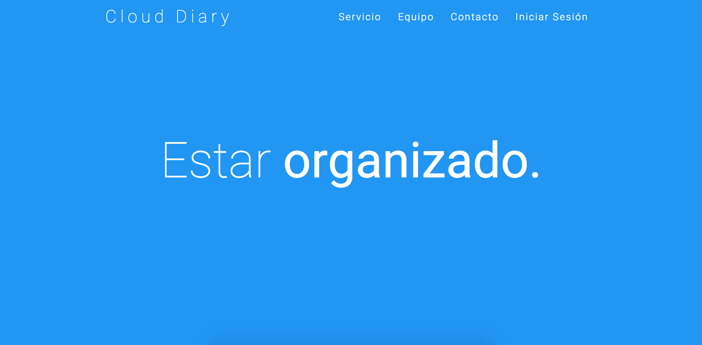
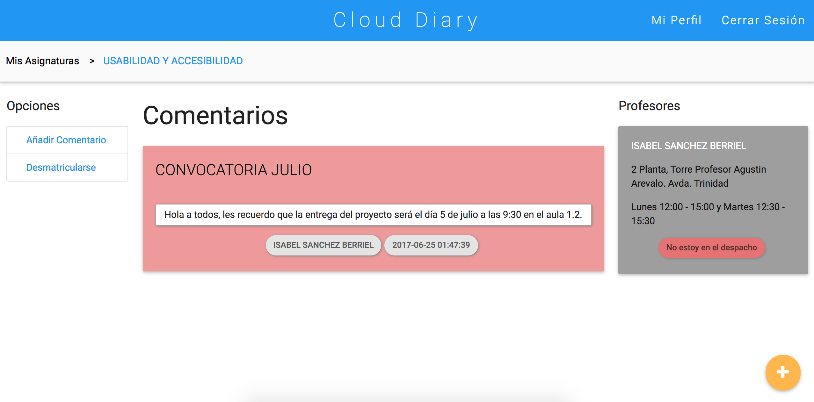
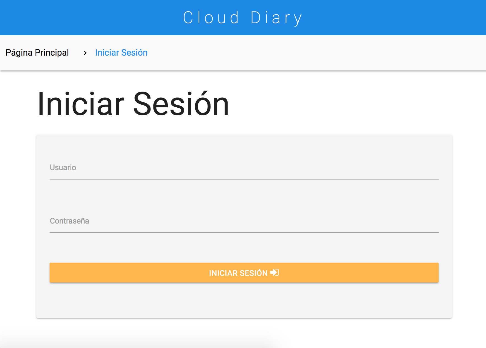
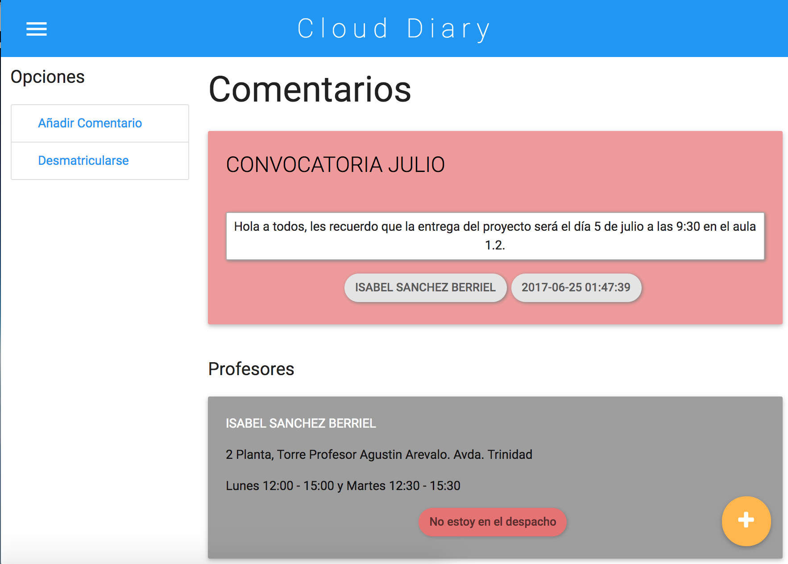
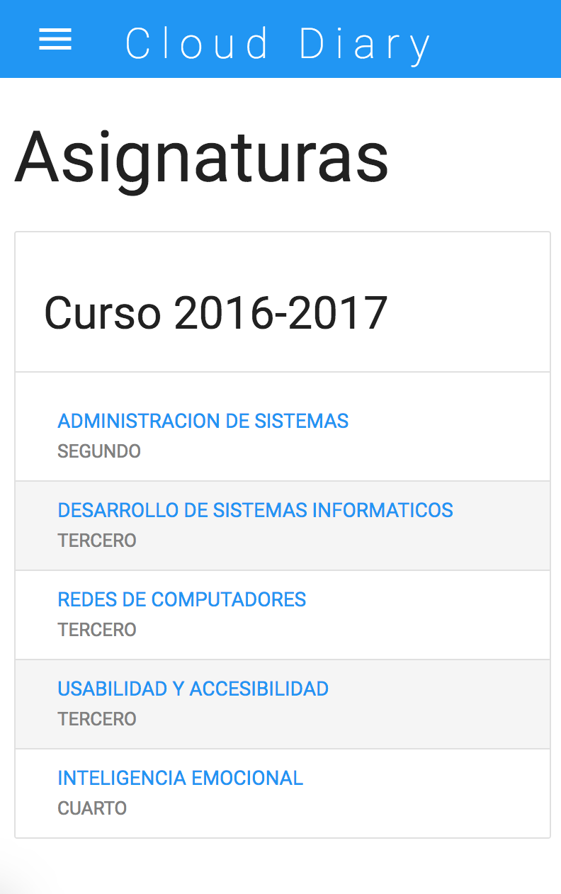
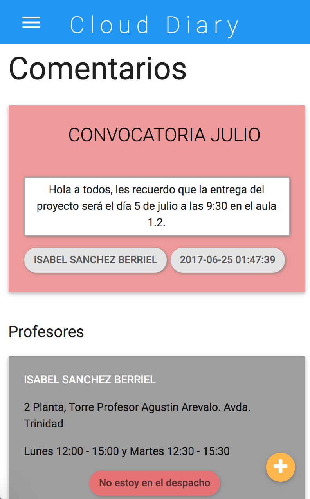

   

# Proyecto Final

En este repositorio se encuentran los ficheros principales del proyecto final realizado en la asignatura de Usabilidad y Accesibilidad en el curso 2016 - 2017.

## Objetivos

El objetivo principal del proyecto consiste en realizar una plataforma web usable y accesible que permita a alumnos y profesores mantener sus asignaturas organizadas y favorecer el contacto entre ellos. De esta forma, la idea a desarrollada es un diario de clase para las diferentes asignaturas, donde los alumnos y profesores pueden añadir comentarios y mantener una comunicación directa al estilo de un foro.

## Prototipo Funcional

El prototipo funcional es accesible desde el siguiente enlace: 
* [Prototipo Funcional](http://banot.etsii.ull.es/alu4606/proyectoUYA/index.html)

### Estructura Repositorio

A continuación se muestra la salida de la ejecución del comando `$ tree --dirsfirst`, para ver la estructura del repositorio:

```
├── css
│   ├── asi.css
│   ├── comentario.css
│   ├── content.css
│   ├── font-awesome.min.css
│   ├── login.css
│   ├── materialize.css
│   ├── materialize.min.css
│   ├── personal.css
│   ├── profile.css
│   └── style.css
├── img
│   ├── avatar1.png
│   ├── avatar3.png
│   ├── avatar4.png
│   └── parallax2.jpg
├── js
│   ├── estado.js
│   ├── init.js
│   ├── jquery-2.1.1.min.js
│   ├── materialize.js
│   ├── materialize.min.js
│   └── modernizr.js
├── README.md
├── asignatura.php
├── cambiarestado.php
├── comentario.php
├── conexion.php
├── content.php
├── index.html
├── login.php
├── logout.php
├── profile.php
└── session.php
```

| Fichero / Directorio | Contenido                           |
|:--------------------:|-------------------------------------|
| css/                 | Directorio con los ficheros .css |
| img/                 | Directorio con las imágenes |
| js/                  | Directorio con los ficheros .js |
| asignatura.php       | Fichero para mostrar el contenido de cada asignatura |
| cambiarestado.php    | Fichero que permite cambiar el estado de las tutorias a un profesor | 
| comentario.php       | Fichero que permite a los usuarios añadir un comentario nuevo | 
| conexion.php         | Fichero que permite establecer la conexión con la base de datos MySQL | 
| content.php          | Fichero que muestra para cada usuario sus asignaturas matriculadas | 
| index.html           | Fichero que contiene la página principal | 
| login.php            | Fichero que permite iniciar sesión a los usuarios | 
| logout.php           | Fichero que cierra la sesión de los usuarios | 
| profile.php          | Fichero que muestra el perfil de cada usuario | 
| session.php          | Fichero que aporta seguridad a la plataforma creando y destruyendo las `sessions` del navegador |  

### Mockups

A continuación se muestran algunas caputras de pantalla de los mockups para diferentes dispositivos.

###### Dispositivos de escritorio (>992px)

* Mockup de la página principal



* Mockup de la página de una asignatura



###### Tablets (>600px)

* Mockup de la página de inicio de sesión



* Mockup de la página de una asignatura



###### Dispositivos móviles (<=600px)

* Mockup de la página de contenido



* Mockup de la página de una asignatura

 

## Tecnologías

Las principales tecnologías utilizadas durante el desarrollo han sido:
* HTML5
* CSS3
* JavaScript
* PHP
* JQuery
* Ajax
* Materialize
* MySQL

## Autores

* [Alejandro Arzola García](https://aleag.github.io/)
* [Néstor García Moreno](https://nestor-gm.github.io/)
* [Omar Mendo Mesa](https://ozzrocker95.github.io/)